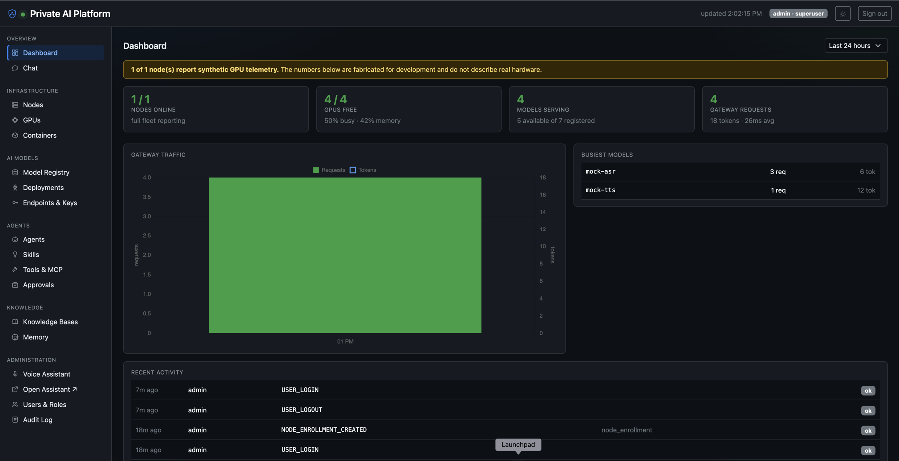
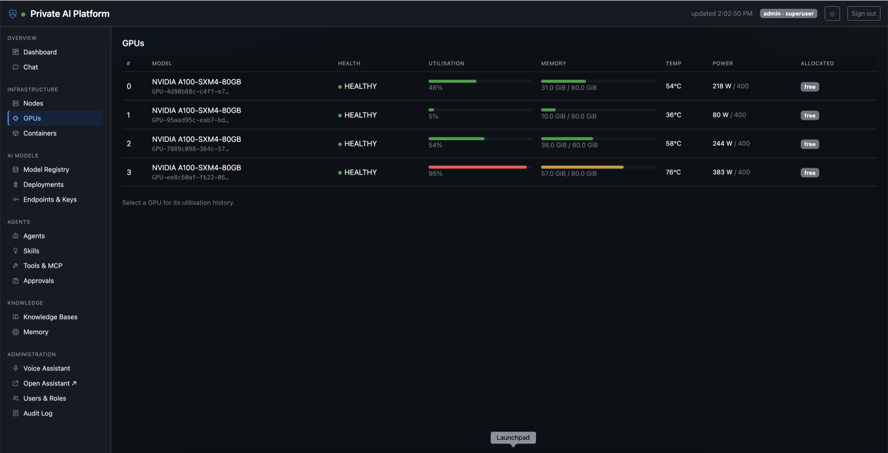
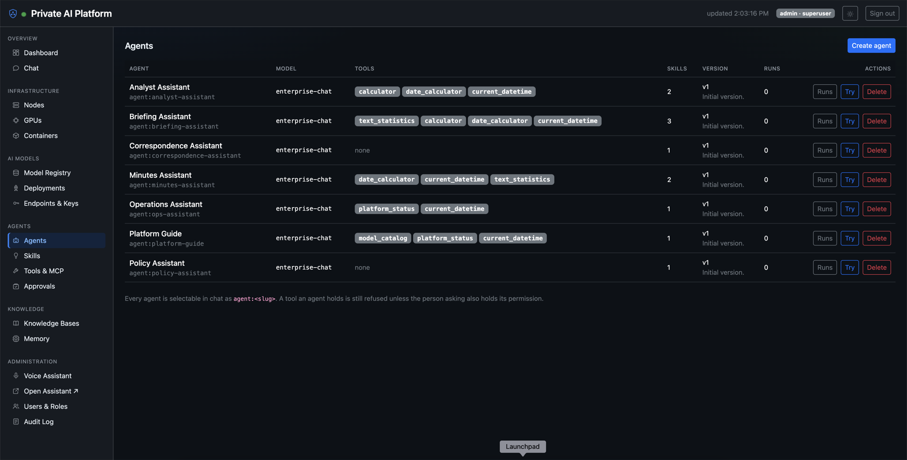
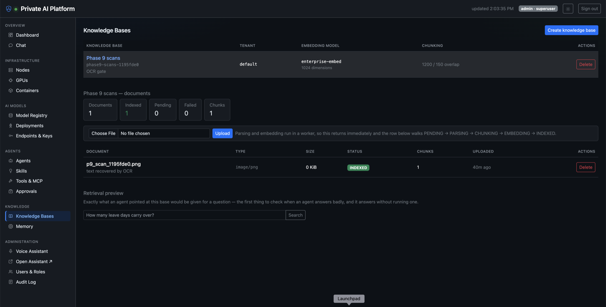

# Private AI Platform

A self-hosted AI control plane that runs with **no route to the Internet**: GPU
infrastructure monitoring, a model registry and deployment state machine, an
OpenAI-compatible gateway, an agent platform (LangGraph + MCP + skills + tools), RAG,
chat, speech and OCR, full observability, and an offline installation bundle.

Built to a 28-module specification across 10 phases. **Every phase has a passing
acceptance gate that runs on a laptop with no GPU.**

[](LICENSE)

*No CI badge here yet, deliberately: a badge whose number is baked into its URL is a claim
nobody re-checks. Run `make check` and the gates yourself — that is what
[Verifying it](#verifying-it) is for, and it takes one command.*



---

## Deploying it

The intended shape is a **control plane plus one or more GPU machines**. The control
plane holds the registry, scheduler, gateway and agent runtime; each GPU host runs only
the node agent, which reports its cards and starts model containers on instruction.

```bash
# On the control plane
git clone https://github.com/mkamranr/private-ai-platform.git ai-platform
cd ai-platform
make up                   # generates real secrets, builds, waits for healthy
make seed                 # roles, permissions, bootstrap admin
make definitions-import   # the shipped agents, skills and tools
```

Sign in at **http://localhost:8080** as `admin` (the password was generated into `.env` —
`grep AUTH__BOOTSTRAP_ADMIN_PASSWORD .env`), then **Nodes → Add node**. The console issues
a one-time token and prints the exact command for the GPU host:

```bash
# On each GPU machine — needs the NVIDIA driver and container toolkit
sudo ./install-node.sh --server https://your-control-plane --name gpu-node-01 --token aine_...
```

The node reports its cards within a poll interval, the control plane probes it back before
accepting it, and its GPUs become schedulable capacity. Deploy a model from the registry
and the scheduler places it — tensor-parallel across cards when a model needs more than one.

**[docs/deployment.md](docs/deployment.md)** covers driver requirements, VRAM sizing,
multi-GPU placement, and the air-gapped install.

## It also runs without much GPU, or none at all

Nothing above is a hard requirement, which is unusual for a platform of this shape and is
deliberate — the reference development machine has no NVIDIA hardware at all.

| You have | What to run |
|---|---|
| **24 GB+ per card** | vLLM, unquantised. The normal path |
| **8–16 GB cards** | vLLM with a 4-bit AWQ/GPTQ model, or a smaller model. Cap `gpu_memory_utilization` and `max_model_len` at deploy time |
| **No GPU** | `make local-llm` serves a quantised GGUF with llama.cpp on CPU. Slower, entirely usable for development |
| **Nothing at all** | The `mock` runtime returns structured placeholder text, so every code path — deployment, gateway, agents, RAG — is exercisable with no weights |

A GPU-free laptop can run the whole platform and its full test suite, including the
end-to-end agent scenario. **[docs/quickstart.md](docs/quickstart.md)** is that path, in
about ten minutes.

<table>
<tr>
<td width="50%"></td>
<td width="50%"></td>
</tr>
<tr>
<td width="50%"></td>
<td width="50%">

**What you are looking at**

*GPU telemetry* straight from the node agent — utilisation, memory, temperature, power,
and whether each card is free or allocated.

*Agents* with the tools and skills each one holds. A tool an agent holds is still refused
unless the person asking holds its permission.

*Knowledge* — a scanned PNG whose text was recovered by OCR, chunked, embedded and
indexed, with a retrieval preview showing exactly what an agent would be given.

</td>
</tr>
</table>

## Air-gapped sites

Where the target has no route to the Internet, the whole platform ships as one bundle:

```bash
make bundle                                   # on a connected build machine, ~1.9 GB
# carry bundle/<stamp>/ to the target, then:
sudo ./install.sh . /opt/ai-platform
```

The bundle carries every image, wheel and manifest. The target pulls nothing, ever — and
a joining GPU node fetches its ~288 MB installer from the control plane rather than
needing the bundle carried to every rack.

---

## What it actually does

| | |
|---|---|
| **Infrastructure** | Registers GPU hosts, reads live telemetry, controls containers — and refuses to touch containers it does not own |
| **Models** | Registry, a deployment state machine with GPU-aware scheduling, and runtimes: vLLM, llama.cpp, Ollama, hosted providers, or a synthetic engine for GPU-free development |
| **Gateway** | OpenAI-compatible at `/v1`. The **stock `openai` client works unmodified** — streamed, routed through an alias, tokens accounted |
| **Agents** | Versioned agents, skills, tools and MCP servers, with an authorisation pipeline and durable human approval for privileged actions |
| **Knowledge** | Upload a document, an agent answers from it and cites it — with every search tenant-scoped |
| **Chat** | Open WebUI consuming the gateway and nothing else, with each user's usage attributed to them rather than to one service key |
| **Speech & vision** | Transcription and synthesis in Arabic and English, OCR that makes a scanned page searchable and cites its page numbers |
| **Observability** | Metrics, logs and traces that **join up**: an error a user saw leads to the log line, the log line to the trace, the trace to the agent run |
| **Operations** | Backup and verified restore, RBAC, OIDC/LDAP, scoped API keys, and a full audit trail |

## The core principle

**Do not rebuild mature open-source technology.**

PostgreSQL, Qdrant, MinIO, Valkey, vLLM, Open WebUI, Prometheus, Grafana, Loki, Tempo and
Langfuse are used as they are. The custom code here is the control plane: registry,
scheduler, policy engine, gateway, agent runtime, and the API that ties them together.

## Verifying it

```bash
make check          # ruff, mypy, layering contracts, ~592 tests across four services
make gate           # Phase 0 acceptance gate
make gate-phase4    # the MVP scenario: an agent using tools, end to end
make gate-phase8    # installs inside a container with --network none, upgrades, rolls back
```

Every gate runs on a machine with no GPU. `make gate-phase8` is the one worth pointing at:
it installs the platform from a bundle inside a container that has **no network route at
all**, then migrates, seeds, signs in, upgrades and rolls back.

> **Gates drop every table.** Eight of them prove migrations reverse cleanly by running
> `alembic downgrade base`. They restore the seed data, the shipped catalogue and chat
> credentials — but not models you registered yourself. Never run one against something
> you care about.

## Documentation

| | |
|---|---|
| [quickstart.md](docs/quickstart.md) | Running on a laptop in ten minutes |
| [deployment.md](docs/deployment.md) | Production, GPU nodes, air-gapped sites |
| [architecture.md](docs/architecture.md) | How it fits together, and where the seams are |
| [airgap.md](docs/airgap.md) | Bundle, install, upgrade, rollback with no Internet |
| [gpu.md](docs/gpu.md) · [models.md](docs/models.md) | GPU nodes; registry, runtimes, hosted providers |
| [agents.md](docs/agents.md) · [skills.md](docs/skills.md) · [tools.md](docs/tools.md) · [mcp.md](docs/mcp.md) | The agent platform |
| [rag.md](docs/rag.md) · [chat.md](docs/chat.md) · [speech.md](docs/speech.md) · [voice.md](docs/voice.md) | Knowledge, chat, speech |
| [security.md](docs/security.md) · [database.md](docs/database.md) · [backup.md](docs/backup.md) | Security model, schema, backup and restore |
| [observability.md](docs/observability.md) · [api.md](docs/api.md) | Metrics, logs, traces; the HTTP surface |
| [troubleshooting.md](docs/troubleshooting.md) | Failures that have actually happened |

Contributing: [CONTRIBUTING.md](CONTRIBUTING.md) · Security policy: [SECURITY.md](SECURITY.md)

## Layout

```
backend/        FastAPI control plane — the bulk of the code
node-agent/     runs on each GPU host: telemetry, container control
frontend/       admin console (vanilla JS, vendored deps, no build step)
agents/ skills/ tools/    shipped definitions, imported at install
mcp/ldap/       LDAP MCP server (fixture directory, no AD needed)
models/         manifests
docker/         per-service config
mock-vllm/      OpenAI-compatible fake runtime — no weights, no GPU
scripts/        check_airgap, backup, build_bundle, gen_certs, gen_secrets, phase{0..9}_gate
offline/        install / upgrade / rollback — run on the air-gapped target
bundle/         built offline bundles     (git-ignored, ~1.9 GB each)
docs/           the contract
```

---

## Phases

| | | status |
|---|---|---|
| 0 | Foundation, config, interfaces, auth/audit skeletons, contract docs | ✅ |
| 1 | Node agent, GPU monitoring (incl. `FakeGpuProbe`), Docker abstraction, admin UI | ✅ |
| 2 | Model registry, deployment, gateway, `mock-vllm` → **usable private LLM platform** | ✅ |
| 3 | Open WebUI consuming the gateway, per-user attribution, admin dashboard | ✅ |
| 4 | Agents, skills, tools, MCP, tool pipeline → **§20 MVP scenario passes** | ✅ |
| 5 | Knowledge bases, RAG ingestion, three-layer memory, tenant scoping | ✅ |
| 6 | Full RBAC, OIDC, API keys, developer portal, backup/restore | ✅ |
| 7 | Prometheus, Loki, Tempo, Grafana, Langfuse | ✅ |
| 8 | Air-gap bundle, packaging, install/upgrade/rollback, docs | ✅ |
| 9 | STT/TTS (Arabic + English), OCR, vision | ✅ |

Value lands early and independently: Phase 2 gives a usable private LLM platform,
Phase 3 private chat, Phase 4 the agent platform.

---

## Three deviations from the spec

Stated plainly, with rationale in
[architecture.md §14](docs/architecture.md#14-deviations-from-the-spec-in-one-place).

1. **Auth/RBAC and audit skeletons are in Phase 0**, not Phase 6. Building ~18 modules
   of API surface before `require_permission()` exists means retrofitting authorisation
   into every route later, which is how authorisation gaps ship.
2. **Air-gap is a Phase 0 constraint**, not only a Phase 8 deliverable. Eight phases of
   pulling freely from PyPI and Docker Hub produce a dependency graph that cannot be
   bundled. Discipline now (`make airgap`), bundle tooling at Phase 8.
3. **§28's interfaces are written before their implementations.** Empty ABCs cost
   nothing up front and are what prevent the Docker/vLLM dead end §28 warns about.

Plus: Valkey over Redis (licensing), `${PLATFORM_DATA_ROOT}` over `/data/ai-platform`
(Docker Desktop does not share `/data`), asyncpg for Alembic (one driver in the bundle),
and `COMMAND`/`PYTHON` tool types registerable but disabled (§25 forbids unrestricted
shell execution by agents).

Phase 1 added two more: node agent tokens are stored **Fernet-encrypted** rather than
hashed (the platform presents the token rather than verifying one, so a hash would be
unusable — and an in-memory cache would silently stop the fleet being polled after every
restart), and the node agent **refuses control of containers it did not create**, which is
what stops the platform stopping its own database.

Phase 2 added one: the **OpenAI-compatible surface is mounted at `/v1`, not under
`/api/v1`**. The SDK derives every path from `base_url`, so `client.models.list()` would
otherwise collide with the platform's own model registry — same path, two resources, two
credentials. Splitting the roots is what every OpenAI-compatible server does.

Phase 5 added one: **`mock-embed` serves hashed bag-of-words vectors, not random ones.**
A random-vector mock makes every similarity ≈ 0, so any sensible relevance floor filters out
everything and retrieval cannot be tested at all — a search returns nothing whether the
pipeline works or not. Lexical overlap makes retrieval *correctness* testable without a GPU;
retrieval *quality* still needs a real model.

Phase 4 added the largest one, and you approved it explicitly: **the agent runtime is
native, not LangGraph.** §2 says integrate rather than implement, and that is why vLLM,
Qdrant and Open WebUI are here unforked — but LangGraph would have added 38 packages to the
air-gapped bundle including a *second* PostgreSQL driver (reversing a Phase 0 decision) and
a telemetry client, plus three adapter layers, and it keeps run state in its own tables as
opaque blobs that the M25 backup and M24 audit cannot read. `AgentRuntime` is the §28 seam
that makes this reversible; a `LangGraphAgentRuntime` is an addition, not a rewrite.
Reasoning in [docs/agents.md](docs/agents.md#the-runtime-and-why-it-is-not-langgraph).

Phase 3 added two. **A trusted client may assert who a request is for**, verified by
signature rather than believed on sight — without it a shared chat frontend bills the
whole organisation to one identity, and with it believed on sight any key holder could
bill their traffic to anyone. And **Open WebUI's persistent config is disabled**, so the
compose file stays the source of truth rather than being silently frozen into its
database on first boot.

---

## How it runs without a GPU

Not a demo mode, and worth understanding before trusting the section above.

The reference development machine has none, so vLLM and DCGM cannot run on it. Every
GPU and inference touchpoint sits behind an interface with a fake implementation —
`FakeGpuProbe` synthesises four A100s with fluctuating telemetry, and `mock-vllm` serves
OpenAI-compatible SSE with a configurable startup delay, so the deployment state machine
genuinely waits on `HEALTH_CHECK` rather than skipping it.

`make gate-phase2` deploys a model, streams a completion through the stock `openai`
client and checks the tokens were accounted for — all on a laptop with no NVIDIA driver.

This makes the §20 MVP scenario an automated end-to-end test runnable on a laptop.
Re-running that same suite on real hardware with `GPU__PROBE=nvidia_smi` is the real
test: anything that passes locally and fails there marks a leak in an interface
boundary — exactly the signal §28 exists to give.

---

## Licence

[Apache License 2.0](LICENSE). Third-party components keep their own licences; the
offline bundle carries them alongside the wheels and images it ships.
